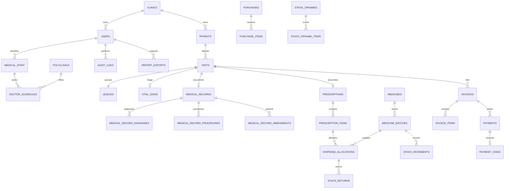

# Arsitektur dan relasi data

## Lapisan

Livewire class-based + Blade -> Actions per domain -> Eloquent/MySQL. Validasi dan authorization juga berada di Actions, bukan hanya tampilan. Gate permission memakai Spatie; policy kunjungan memastikan clinic isolation. Query daftar memakai scope eksplisit, eager loading, dan pagination.

Satu klinik aktif per user (`users.clinic_id`). Data operasional dan master memiliki `clinic_id`; belum ada pemilihan cabang atau tenancy global. Status didefinisikan dengan PHP enum dan disimpan sebagai string. Foreign key menjaga relasi historis. Uang memakai decimal(15,2), kalkulasi BCMath; floating point hanya dipakai untuk format tampilan dan BMI.

## ERD inti

## Kontrak transaksi

- `SavePatient`: input data pasien terverifikasi, output pasien dengan RM unik; NIK kosong menjadi null.
- `VisitWorkflow`: pendaftaran menghasilkan visit, queue, invoice draft, dan item tarif snapshot secara atomik. Sequence dan jadwal memakai row lock.
- `ClinicalWorkflow`: triage -> konsultasi -> finalisasi; draft dapat diperbarui, final hanya amendment. Tindakan ditambahkan ke billing saat finalisasi.
- `DispensePrescription`: submitted -> processing -> ready -> dispensed. Lock visit, resep, invoice dan batch FEFO; alokasi, OUT ledger, billing dan status commit bersama. Request ulang pada resep dispensed tidak mengurangi stok lagi.
- `InventoryWorkflow`: penerimaan/retur/opname/adjustment selalu memiliki ledger. Batch kedaluwarsa hari ini atau sebelumnya dan karantina tidak dapat didispense.
- `BillingWorkflow`: draft -> issued -> paid; pembayaran idempotent dan penuh. Reversal pembayaran membuka saldo. Invoice lama dapat void dan diganti, bukan diedit setelah penerbitan.
- `GenerateReport`: job memverifikasi ulang akun, permission dan clinic; file disimpan privat, hanya pemohon berizin yang dapat mengunduh. Sel Excel data menggunakan tipe string agar teks tidak dieksekusi sebagai formula.

## Definisi laporan

Pendapatan memakai tanggal pembayaran sebagai pemasukan dan tanggal reversal sebagai pengurang. Laporan posisi stok adalah saldo saat ini; mutasi memakai periode. Nilai stok = saldo batch x harga beli batch. Grafik kunjungan berdasarkan visit_date. Nomor RM/antrean/dokumen unik dijaga oleh sequence dan constraint database.

Timestamp aplikasi dan tanggal pelayanan memakai Asia/Jakarta. Tidak ada integrasi situs referensi pada runtime. Rahasia hanya dalam `.env`; PDF dan ekspor berada di private storage.
